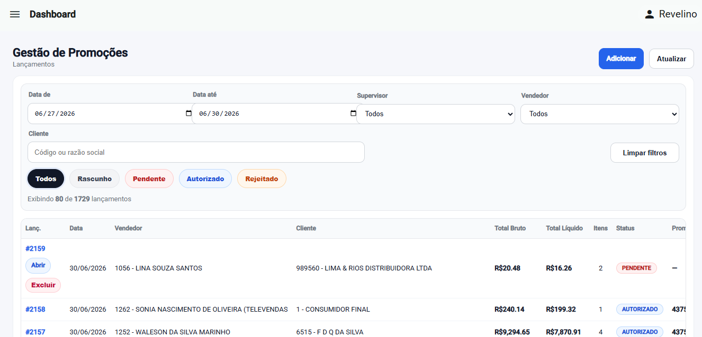
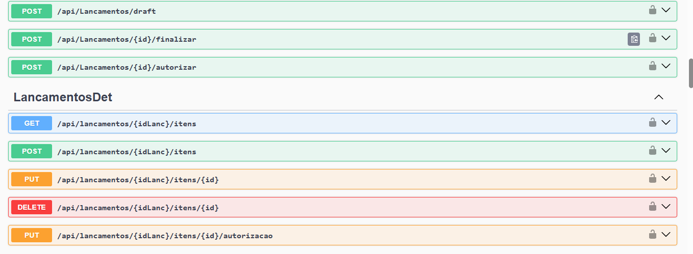
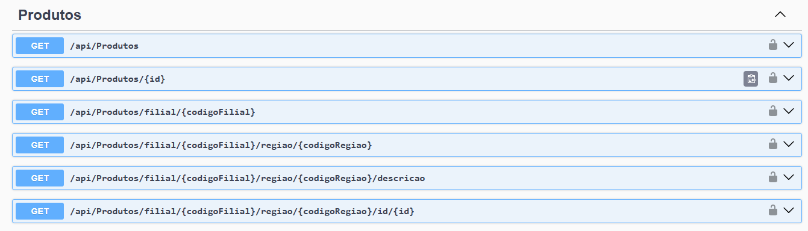

# DsGestor API

Clean Architecture .NET API for sales approval workflow, promotion management, Oracle Database and TOTVS WinThor ERP integration.

## Overview

DsGestor API is a portfolio version of a real business backend solution developed by Dinâmica SYS.

The project demonstrates how a modern .NET API can support ERP integrations, commercial approval workflows and business process automation.

Sensitive data, credentials, customer information, production endpoints and proprietary business details were removed or replaced with sample values.

## Business Context

The solution was designed to support sales teams, supervisors and managers in commercial negotiations.

Sales representatives can submit discount and margin requests. Managers and supervisors can approve or reject the request. Once approved, the promotion is automatically published to the TOTVS WinThor ERP and becomes available for commercial operations.

The platform centralizes commercial approvals and ensures that negotiated conditions are validated before being released to the ERP environment.

## Main Features

- Sales approval workflow
- Promotion management
- Product margin control
- Discount authorization
- Automatic promotion publishing to ERP
- Oracle Database integration
- TOTVS WinThor ERP integration
- Cote Fácil integration
- JWT authentication
- Role-based authorization
- Swagger documentation
- Clean Architecture structure

## Technologies

- C#
- ASP.NET Core
- Oracle Database
- REST APIs
- JWT Authentication
- Swagger / OpenAPI
- Clean Architecture
- Repository Pattern
- Dependency Injection
- ERP Integration

## Architecture

The solution follows Clean Architecture principles:

- Domain: entities and core business rules
- Application: use cases, services, DTOs and interfaces
- Infrastructure: database access, repositories and external integrations
- API: controllers, endpoints, authentication and application startup

## Project Structure

```text
DsGestor.Api
DsGestor.Application
DsGestor.Domain
DsGestor.Infrastructure
```

## Screenshots

### Promotion Management Dashboard

Commercial approval workflow used by sales representatives, supervisors and managers.



### Sales Approval Workflow

REST endpoints responsible for draft creation, approval, authorization and promotion publishing.



### Product Integration

Oracle and ERP integration endpoints used to expose product and commercial information.



## Cote Fácil Integration

The API also provides integration endpoints used to exchange product, pricing, inventory and commercial information with the Cote Fácil platform.

This integration allows external systems and marketplaces to consume ERP information through a standardized REST interface.

## Security

- JWT Authentication
- Role-based Authorization
- Protected Endpoints
- User Access Control

## Portfolio Notes

This repository is intended for portfolio and technical demonstration purposes.

It showcases experience with:

- Enterprise Software Development
- ERP Integration
- Oracle Database
- Backend Architecture
- Business Workflow Automation
- REST APIs
- Clean Architecture
- Commercial Approval Systems

## Author

Revelino Santos

Senior .NET Developer | C#, APIs, Oracle, SQL Server, ERP Integration

GitHub:
https://github.com/revelinosantos

LinkedIn:
https://www.linkedin.com/in/revelinosantos